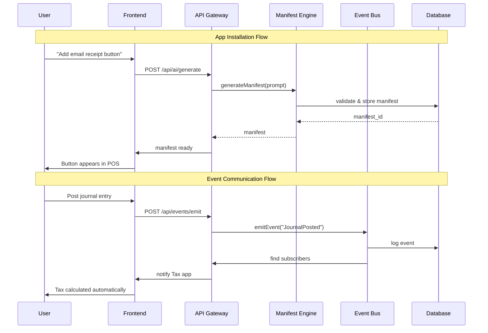
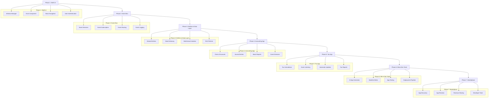
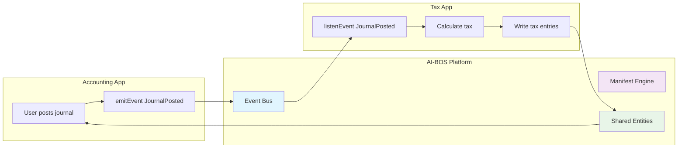
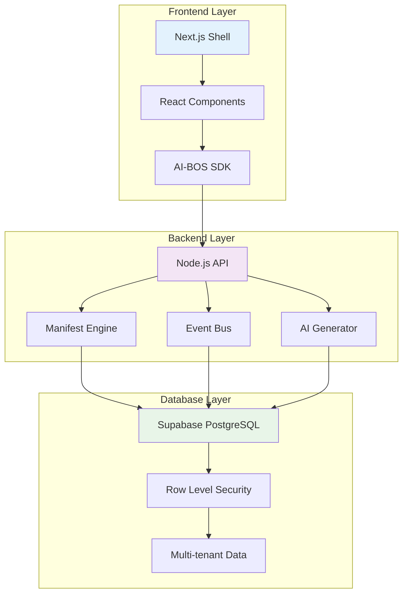
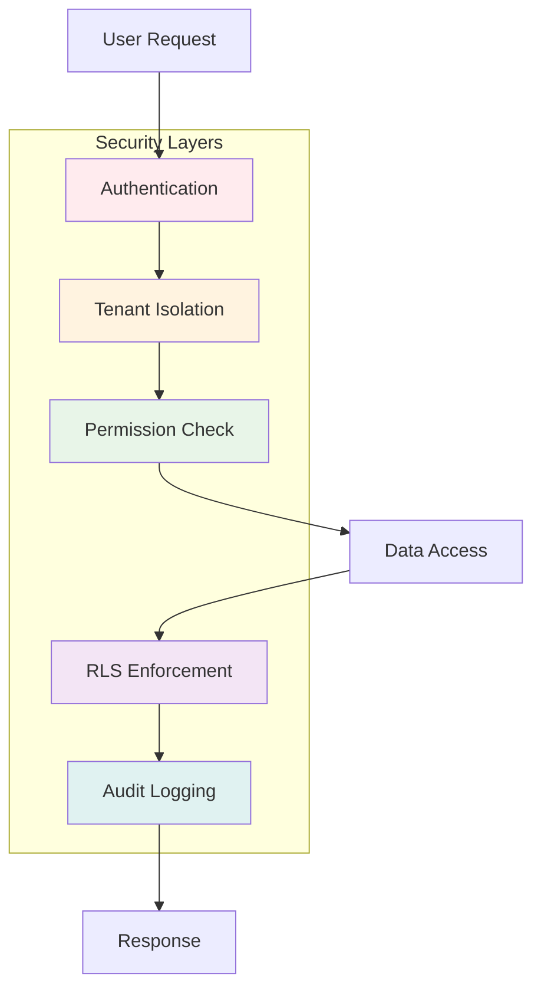

# AI-BOS Diagrams

## 1. Mermaid.js Architecture Diagram

```mermaid
graph TD
    subgraph "Frontend: SaaS Shell"
        A[Accounting App Window]
        B[Tax App Window]
        C[Dock]
        D[Spotlight Search]
    end

    subgraph "SDK Layer"
        E[AI-BOS SDK]
        F[Event Bus Client]
    end

    subgraph "Backend: Platform Runtime"
        G[Manifest Engine]
        H[Event Bus Server]
        I[API Gateway]
        J[AI Generator]
    end

    subgraph "Database: Supabase"
        K[Entities Table]
        L[Events Log]
        M[Manifests Table]
        N[Tenants Table]
        O[Apps Table]
    end

    A -->|emitEvent(JournalPosted)| E
    B -->|listenEvent(JournalPosted)| E
    C -->|launch app| E
    D -->|search apps/data| E
    E --> F
    F --> H
    E --> I
    I --> G
    I --> J
    G --> M
    H --> L
    I --> K
    I --> N
    I --> O
    
    H -->|dispatch event| B
    G -->|validate manifest| E
    J -->|generate app| G
```

## 2. API Endpoints Diagram



## 3. MVP Rollout Flowchart



## 4. How Accounting & Tax Talk Automatically



## 5. Micro-Developer Flow

```mermaid
graph TD
    A[Maria: "Add email receipt button"] --> B[AI Generator]
    B --> C[Generate Manifest]
    C --> D[Validate Manifest]
    D --> E{Valid?}
    E -->|Yes| F[Install App]
    E -->|No| G[Return Error]
    F --> H[Create UI Components]
    H --> I[Deploy to Platform]
    I --> J[Button appears in POS]
    J --> K[Maria uses new feature]

    style A fill:#fff3e0
    style B fill:#e3f2fd
    style C fill:#f3e5f5
    style D fill:#e8f5e8
    style F fill:#e8f5e8
    style J fill:#fff3e0
```

## 6. Data Flow Architecture



## 7. Security & Compliance Flow



These diagrams provide a complete visual understanding of:

1. **Architecture**: How all components connect
2. **API Flow**: How requests and events flow through the system
3. **MVP Plan**: Your step-by-step build strategy
4. **App Communication**: How Accounting and Tax talk automatically
5. **Micro-Dev Process**: How Maria builds apps with AI
6. **Data Flow**: How data moves through the platform
7. **Security**: How the platform stays secure and compliant

You can copy any of these Mermaid diagrams into:
- GitHub README files
- Documentation
- Notion pages
- Any Markdown editor that supports Mermaid 