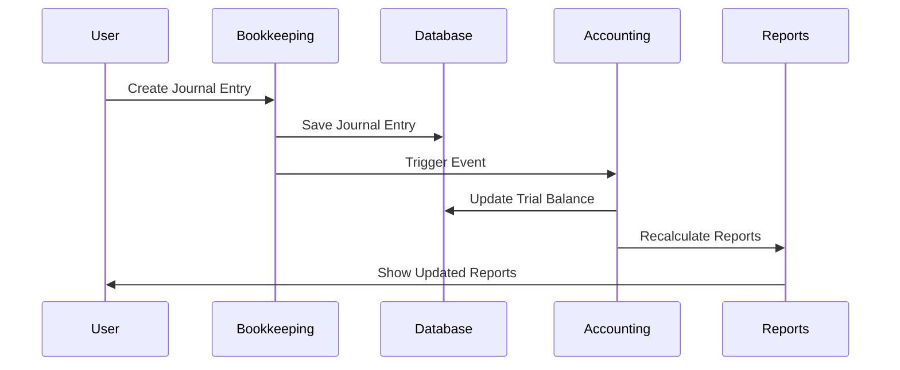

# AI-BOS Module Ecosystem Integration Guide

## Overview

This guide explains how the AI-BOS ecosystem works when customers download multiple modules (like Bookkeeping → Accounting) and how these modules integrate, share data, and work together seamlessly.

## 🎯 **Scenario: Customer Downloads Bookkeeping → Accounting**

### **Step 1: Customer Downloads Bookkeeping Module**
```
Customer Action: Downloads "AI-BOS Bookkeeping Module"
├── Module ID: bookkeeping-module
├── Version: 1.2.0
├── Category: accounting
├── Dependencies: []
└── Data Tables: 
    ├── chart_of_accounts
    ├── journal_entries
    ├── bank_transactions
    └── general_ledger
```

### **Step 2: Customer Downloads Accounting Module**
```
Customer Action: Downloads "AI-BOS Accounting Module"
├── Module ID: accounting-module
├── Version: 2.1.0
├── Category: accounting
├── Dependencies: ["bookkeeping-module"]
└── Data Tables:
    ├── financial_reports
    ├── trial_balance
    ├── balance_sheet
    └── income_statement
```

## 🔄 **How the Ecosystem Works**

### **1. Shared Database Architecture**

All modules share the same database schema but with **module-specific tables** and **shared core tables**:

```sql
-- Shared Core Tables (Available to all modules)
organizations
users
audit_logs
metadata_registry

-- Bookkeeping Module Tables
chart_of_accounts
journal_entries
bank_transactions
general_ledger

-- Accounting Module Tables
financial_reports
trial_balance
balance_sheet
income_statement

-- Cross-Module Integration Tables
module_integrations
data_sync_logs
cross_module_references
```

### **2. Module Integration System**

#### **A. Data Flow Between Modules**
```typescript
// Bookkeeping Module → Accounting Module
interface DataFlow {
  source: {
    module: 'bookkeeping-module';
    table: 'journal_entries';
    trigger: 'journal_entry_created';
  };
  target: {
    module: 'accounting-module';
    action: 'update_trial_balance';
    data: JournalEntryData;
  };
}
```

#### **B. Real-time Data Synchronization**
```typescript
// When a journal entry is created in Bookkeeping
// It automatically updates the Trial Balance in Accounting

// Bookkeeping Module
async createJournalEntry(entry: JournalEntry) {
  // 1. Save to bookkeeping table
  await db.journal_entries.insert(entry);
  
  // 2. Trigger cross-module event
  await moduleRegistry.triggerEvent('journal_entry_created', {
    moduleId: 'bookkeeping-module',
    data: entry,
    timestamp: new Date()
  });
}

// Accounting Module (listens for events)
moduleRegistry.onEvent('journal_entry_created', async (event) => {
  // 3. Update trial balance
  await updateTrialBalance(event.data);
  
  // 4. Recalculate financial reports
  await recalculateFinancialReports();
});
```

### **3. Module Dependency Management**

#### **A. Installation Order**
```typescript
// When installing Accounting module
async installModule('accounting-module') {
  // 1. Check dependencies
  const dependencies = await getModuleDependencies('accounting-module');
  
  // 2. Verify Bookkeeping is installed
  if (!await isModuleInstalled('bookkeeping-module')) {
    throw new Error('Bookkeeping module must be installed first');
  }
  
  // 3. Install Accounting module
  await installModuleFiles('accounting-module');
  
  // 4. Set up data integration
  await setupModuleIntegration('bookkeeping-module', 'accounting-module');
}
```

#### **B. Data Migration & Setup**
```typescript
// When Accounting module is installed
async setupAccountingModule() {
  // 1. Create accounting-specific tables
  await createAccountingTables();
  
  // 2. Migrate existing bookkeeping data
  await migrateBookkeepingData();
  
  // 3. Set up integration triggers
  await setupIntegrationTriggers();
  
  // 4. Initialize financial reports
  await initializeFinancialReports();
}
```

## 🗄️ **Database Integration Strategy**

### **1. Shared Schema Approach**

```sql
-- All modules share the same database
-- Each module has its own tables with module prefix

-- Bookkeeping Module Tables
CREATE TABLE bookkeeping_journal_entries (
  id UUID PRIMARY KEY,
  organization_id UUID NOT NULL,
  entry_date DATE NOT NULL,
  description TEXT,
  amount DECIMAL(15,2),
  account_id UUID,
  created_at TIMESTAMP DEFAULT NOW()
);

-- Accounting Module Tables
CREATE TABLE accounting_financial_reports (
  id UUID PRIMARY KEY,
  organization_id UUID NOT NULL,
  report_type VARCHAR(50),
  report_date DATE,
  data JSONB,
  created_at TIMESTAMP DEFAULT NOW()
);

-- Cross-Module Integration Table
CREATE TABLE module_data_integrations (
  id UUID PRIMARY KEY,
  source_module VARCHAR(100),
  target_module VARCHAR(100),
  source_table VARCHAR(100),
  target_table VARCHAR(100),
  integration_type VARCHAR(50), -- 'real_time', 'batch', 'manual'
  last_sync_at TIMESTAMP,
  sync_status VARCHAR(20)
);
```

### **2. Data Consistency & Integrity**

```sql
-- Foreign key relationships across modules
ALTER TABLE accounting_financial_reports 
ADD CONSTRAINT fk_accounting_organization 
FOREIGN KEY (organization_id) 
REFERENCES organizations(id);

-- Cross-module data validation
CREATE OR REPLACE FUNCTION validate_cross_module_data()
RETURNS TRIGGER AS $$
BEGIN
  -- Ensure data consistency between modules
  IF NEW.organization_id NOT IN (
    SELECT organization_id FROM bookkeeping_journal_entries
  ) THEN
    RAISE EXCEPTION 'Organization not found in bookkeeping module';
  END IF;
  
  RETURN NEW;
END;
$$ LANGUAGE plpgsql;
```

## 🔌 **Module Communication System**

### **1. Event-Driven Architecture**

```typescript
// Module Registry Event System
class ModuleEventSystem {
  // Register event listeners
  async registerEventListener(
    moduleId: string,
    eventType: string,
    handler: Function
  ) {
    // Store event handler
  }
  
  // Trigger events across modules
  async triggerEvent(eventType: string, data: any) {
    // Find all modules listening for this event
    const listeners = await this.getEventListeners(eventType);
    
    // Execute handlers
    for (const listener of listeners) {
      await listener.handler(data);
    }
  }
}

// Example: Bookkeeping triggers Accounting update
// Bookkeeping Module
await moduleRegistry.triggerEvent('journal_entry_created', {
  entryId: '123',
  amount: 1000.00,
  accountId: '456',
  organizationId: '789'
});

// Accounting Module (automatically receives event)
moduleRegistry.onEvent('journal_entry_created', async (data) => {
  await updateTrialBalance(data);
  await recalculateFinancialReports();
});
```

### **2. API Integration Between Modules**

```typescript
// Module-to-Module API calls
class ModuleIntegrationAPI {
  // Get data from another module
  async getDataFromModule(
    sourceModule: string,
    endpoint: string,
    params: any
  ) {
    const module = await this.getModule(sourceModule);
    return await module.api.get(endpoint, params);
  }
  
  // Send data to another module
  async sendDataToModule(
    targetModule: string,
    endpoint: string,
    data: any
  ) {
    const module = await this.getModule(targetModule);
    return await module.api.post(endpoint, data);
  }
}

// Example: Accounting gets data from Bookkeeping
const journalEntries = await moduleAPI.getDataFromModule(
  'bookkeeping-module',
  '/api/journal-entries',
  { organizationId: '123', date: '2024-01-01' }
);
```

## 📊 **Data Flow Examples**

### **Example 1: Journal Entry Creation**



### **Example 2: Financial Report Generation**

```typescript
// When user requests Balance Sheet
async generateBalanceSheet(organizationId: string, date: Date) {
  // 1. Get chart of accounts from Bookkeeping
  const accounts = await moduleAPI.getDataFromModule(
    'bookkeeping-module',
    '/api/chart-of-accounts',
    { organizationId }
  );
  
  // 2. Get account balances from Bookkeeping
  const balances = await moduleAPI.getDataFromModule(
    'bookkeeping-module',
    '/api/account-balances',
    { organizationId, date }
  );
  
  // 3. Generate balance sheet in Accounting
  const balanceSheet = await generateBalanceSheetReport(accounts, balances);
  
  // 4. Save to Accounting module
  await moduleAPI.sendDataToModule(
    'accounting-module',
    '/api/financial-reports',
    { type: 'balance_sheet', data: balanceSheet }
  );
  
  return balanceSheet;
}
```

## 🔒 **Security & Permissions**

### **1. Module-Level Permissions**

```typescript
// Each module defines its permissions
interface ModulePermissions {
  bookkeeping: {
    read: ['chart_of_accounts', 'journal_entries'];
    write: ['journal_entries'];
    admin: ['chart_of_accounts'];
  };
  accounting: {
    read: ['financial_reports', 'trial_balance'];
    write: ['financial_reports'];
    admin: ['report_templates'];
  };
}
```

### **2. Cross-Module Data Access**

```typescript
// Module can only access data it has permission for
async getCrossModuleData(moduleId: string, targetModule: string, data: any) {
  // Check if module has permission to access target module data
  const hasPermission = await checkModulePermission(
    moduleId,
    targetModule,
    'read',
    data.table
  );
  
  if (!hasPermission) {
    throw new Error('Module does not have permission to access this data');
  }
  
  return await getModuleData(targetModule, data);
}
```

## 🚀 **Implementation Steps**

### **Phase 1: Core Integration Framework**

1. **Database Schema Setup**
   ```sql
   -- Run the shared schema
   -- Create module-specific tables
   -- Set up integration tables
   ```

2. **Module Registry Enhancement**
   ```typescript
   // Add dependency management
   // Add event system
   // Add cross-module API
   ```

3. **Module Communication Layer**
   ```typescript
   // Implement event-driven architecture
   // Add module-to-module API calls
   // Add data synchronization
   ```

### **Phase 2: Module-Specific Integration**

1. **Bookkeeping Module**
   ```typescript
   // Add event triggers
   // Add data export APIs
   // Add permission definitions
   ```

2. **Accounting Module**
   ```typescript
   // Add event listeners
   // Add data import APIs
   // Add integration setup
   ```

### **Phase 3: Advanced Features**

1. **Real-time Synchronization**
   ```typescript
   // WebSocket connections
   // Live data updates
   // Conflict resolution
   ```

2. **Data Validation**
   ```typescript
   // Cross-module data validation
   // Integrity checks
   // Error handling
   ```

## 📈 **Benefits of This Approach**

### **1. Seamless User Experience**
- Users don't see module boundaries
- Data flows automatically between modules
- Consistent UI/UX across modules

### **2. Scalable Architecture**
- Easy to add new modules
- Modules can be developed independently
- Clear separation of concerns

### **3. Data Integrity**
- Centralized data management
- Consistent data across modules
- Built-in validation and error handling

### **4. Performance**
- Optimized database queries
- Efficient data synchronization
- Minimal data duplication

## 🔧 **Configuration Example**

### **Module Configuration File**

```json
{
  "moduleId": "accounting-module",
  "version": "2.1.0",
  "dependencies": ["bookkeeping-module"],
  "integrations": {
    "bookkeeping-module": {
      "events": {
        "journal_entry_created": {
          "action": "update_trial_balance",
          "priority": "high"
        },
        "chart_of_accounts_updated": {
          "action": "refresh_account_structure",
          "priority": "medium"
        }
      },
      "dataAccess": {
        "read": ["journal_entries", "chart_of_accounts", "account_balances"],
        "write": []
      }
    }
  },
  "permissions": {
    "financial_reports": ["read", "write"],
    "trial_balance": ["read", "write"],
    "balance_sheet": ["read", "write"]
  }
}
```

---

**This ecosystem ensures that when customers download multiple modules, they work together seamlessly, sharing data and providing a unified experience while maintaining module independence and scalability.** 